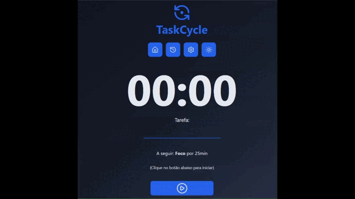
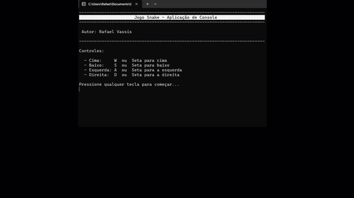

## 👨🏻‍💻 RAFAEL VASSIS

**`Desenvolvedor Front-end`** | **`Estudante de Sistemas de Informação`**

Meu nome é Rafael Vassis, tenho 35 anos e sou natural de Minas Gerais. Atualmente curso o 2º semestre de Sistemas de Informação na PUC-MG. Estou em transição de carreira para TI, focado atualmente em desenvolvimento web e React.

    &nbsp;&nbsp;&nbsp;
    &nbsp;&nbsp;&nbsp;
    &nbsp;&nbsp;&nbsp;
    

---

### 🤖 Linguagens e Tecnologias

  
  
  
  
  
  
  
  

---

### 📂 Projetos

#### 🕒 TaskCycle — React | TypeScript | Vercel

Aplicativo Pomodoro com **gerenciamento de tarefas**, histórico de sessões, tema claro/escuro e temporizador em **Web Worker** para execução em segundo plano.  

**Tecnologias:** React, TypeScript, Vite, Web Workers, CSS Modules, react-toastify, lucide-react

🔗 [Repositório](https://github.com/rafaelvassis/taskcycle-app)

---

#### 🐍 Jogo Snake — C# | Console

Implementação do clássico jogo Snake, estruturada com **POO** e executada em **console**, focando em lógica, organização de classes e tratamento de entradas do usuário.

**Tecnologias:** C#, .NET  

🔗 [Repositório](https://github.com/rafaelvassis/snake-game-csharp-console.git)

---

### 📫 Contato

* [GitHub](https://github.com/rafaelvassis)
* [LinkedIn](https://linkedin.com/in/rafaelvassis)
* [Instagram](https://www.instagram.com/rafael_vassis/)

---

Rafael Vassis | 2026